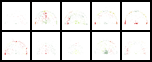

# tsne-shots
t-SNE visualizations of players based on shots in the 2015-2016 NBA season.
To get proper representations of players and their likeliness to other players,
we use a Variational Autoencoder neural network (VAE) to get encoded formations
of shots, to compare with other players for clustering in t-SNE.

For more information about variational autoencoders, please read this [paper](https://arxiv.org/pdf/1312.6114.pdf)

### Setup
- Get dev dependancies
```
sudo apt-get install python-dev libblas-dev liblapack-dev libatlas-base-dev
```

1. Install python libraries
```
pip install -r requirements.txt
```

2. Collect data
```
python get_data.py
```

3. Plot shot charts
```
python savvas_plots.py
```


### VAE Encoding
1. Move train and test images into folders
```
python create_train_test.py
```

2. Train vae from image folders.
```
python main.py
```

3. View visualizations of input images and output reconstructions. Create data file with encoded representations. Notice the gaussian blurs in the reconstructed images.
```
python viz.py
```
#### Original Input Images

#### Reconstructed Images


### t-SNE Visualization
1. Create t-sne embedding from encoded data
```
python t-sne.py
```

2. Cluster the t-sne embedded representations to find like minded shooters. Using DBSCAN clustering
```
python clustering.py
```


### GAN
This may be explored at another time to see different applications, but you can generate fake shot charts in decent resolution using GAN models. For more info on generative adversarial networks, please read this [paper](https://arxiv.org/pdf/1511.06434.pdf)

1. Create fake shot charts. After 25 epochs, see results below.
```
python dcgan.py
```
#### Real Examples

#### Fake Examples

